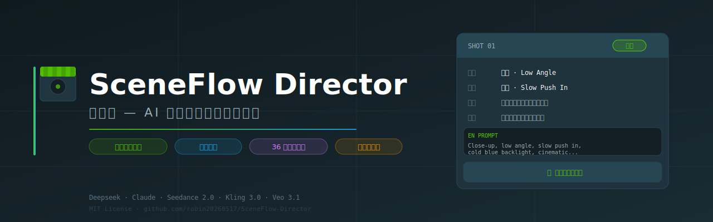

<p align="center">
  
</p>

# 导演台 — AI 分镜与短剧创作工作台

> 输入一句剧情描述，AI 自动拆解完整分镜方案并生成可直接投喂视频模型的提示词；配套剧本工坊一键输出短剧剧本包。

---

## 项目定位

导演台面向短视频创作者、微短剧制片团队，解决从"想法"到"可执行提示词"之间的效率瓶颈：

- **分镜生成**：一句话剧情 → AI 输出结构化分镜（景别/机位/运镜/灯光/声音/英文提示词），可直接用于 Seedance / Kling / Veo 等视频模型
- **剧本工坊**：一句话灵感 → 完整短剧剧本包（创作方案 + 角色 + 分集目录 + 前 N 集剧本），支持海内/海外双模式
- **知识库体系**：内置运镜知识库（景别/机位/运镜/构图规则/情绪映射）、36 位导演风格档案、调色情绪盘、表情/肢体库，可在输入框中用 `@` 快速调用

适合场景：短视频分镜策划、微短剧前期创作、AI 视频生成提示词生产、创作团队标准化工作流建设。

---

## 核心功能

### Create — 创建内容

| 功能 | 说明 |
|------|------|
| **智能分镜** | 输入剧情描述，AI（Deepseek）输出 5-6 个结构化镜头，含景别/机位/运镜/人物表情/肢体动作/灯光/声音/英文视频提示词/禁止项 |
| **剧本工坊** | 输入故事灵感，AI（Claude via Poyo）生成创作方案、角色设定、分集目录、前 N 集完整剧本，海内中文/海外英文双模式 |
| **@ 快速调用** | 在输入框输入 `@` 可快速插入运镜技法、表情动作、调色方案 |

### Review — 审核与校验

| 功能 | 说明 |
|------|------|
| **两段式输出** | AI 先输出"剧情解析"（类型/地点/人物/情绪曲线/动作节点/镜头目的），再输出分镜计划，便于审查 AI 推理过程 |
| **本地兜底** | AI 不可用时自动回退到本地知识库拼接，保证输出可用 |
| **防崩约束** | 可选"连续性锁定""防崩约束""台词口型控制"，注入全局禁止项 |

### Manage — 知识与配置管理

| 模块 | 内容 |
|------|------|
| **运镜库** | 景别/机位/基础运镜/进阶技法，附 SVG 示意图 |
| **导演库** | 36 位导演（华语/好莱坞/日本/韩国/欧洲艺术），ChromaGrid 画廊，点击直接以该导演风格生成分镜 |
| **调色盘** | 情绪调色方案，附 Seedance 2.0 提示词 |
| **表情/肢体/血色库** | 面部微表情/肢体动作/血色分类，点击复制提示词 |

### Publish — 交付输出

- 分镜结果可**一键复制全部**或**导出 JSON**
- 剧本可**复制全文**、**导出 .md** 或**新窗口阅读**
- 英文视频提示词直接可投喂视频生成模型

### Maintain — 持续维护

- Issues 用于功能需求、Bug 反馈、知识库更新建议
- Pull Requests 用于代码变更审查
- Releases 用于版本记录和功能迭代说明

---

## 工作流闭环

```
输入剧情/灵感
     ↓
AI 拆解分析（剧情类型 / 情绪曲线 / 动作节点）
     ↓
生成分镜方案 / 剧本包
     ↓
人工审核（调整导演风格 / 运镜参数 / 场景开关）
     ↓
复制英文提示词 → 投喂视频模型
     ↓
导出 JSON / .md → 交付制作团队
```

---

## 技术栈

- **前端**：原生 HTML / CSS / JavaScript（无框架依赖）
- **AI — 分镜**：[Deepseek API](https://platform.deepseek.com/)（`deepseek-chat`，JSON 结构化输出）
- **AI — 剧本**：[Poyo AI](https://poyo.ai/)（Claude `claude-sonnet-4-6`，Anthropic 原生端点）
- **视频模型适配**：Seedance 2.0 / Kling 3.0 Audio / Veo 3.1 / Happy Horse
- **字体**：Noto Sans SC + Space Mono（Google Fonts）

---

## 项目结构

```
daoyantai/
├── index.html          # 入口页，导航与所有 tab panel
├── app.js              # 主逻辑（Tab 切换、分镜生成、设置管理）
├── ai-engine.js        # Deepseek AI 引擎（分镜，两段式结构化输出）
├── script-engine.js    # 剧本工坊引擎（Claude via Poyo）
├── engine.js           # 运镜知识库核心逻辑
├── data.js             # 运镜/调色/表情数据（CINEMA_KB、COLOR_PALETTE、EXPRESSION_LIBRARY）
├── directors.js        # 36 位导演风格档案（DIRECTOR_PROFILES）
├── director-gallery.js # ChromaGrid 导演画廊渲染
├── motion-icons.js     # 运镜 SVG 示意图生成
├── styles.css          # 全局样式（暗色玻璃质感主题）
├── animations.css      # 动效
├── chroma-grid.css     # 导演画廊网格样式
└── motion-icons.css    # 运镜图标样式
```

---

## 本地开发

本项目为纯静态前端，无需构建步骤：

```bash
git clone https://github.com/YOUR_USERNAME/daoyantai.git
cd daoyantai
# 用任意静态服务器或直接在浏览器打开 index.html
# 推荐：
npx serve .
# 或：
python -m http.server 8080
```

浏览器打开 `http://localhost:8080` 即可使用。

---

## 环境变量 / API Key 配置

本项目不需要服务端，API Key 在浏览器本地配置：

1. 打开应用后点击右上角 **⚙️** 按钮
2. 填入你自己的 API Key：
   - **Deepseek API Key**：前往 [platform.deepseek.com](https://platform.deepseek.com/) 获取，用于智能分镜功能
   - **Poyo API Key**：前往 [poyo.ai](https://poyo.ai/) 获取，用于剧本工坊功能
3. 点击保存，Key 仅存储在浏览器 `localStorage`，不会上传到任何服务器

首次打开会自动弹出引导配置界面。

---

## 构建与部署

纯静态项目，任意静态托管平台均可部署：

- **Cloudflare Pages**：连接仓库，根目录部署，无需构建命令
- **Vercel**：同上，Framework Preset 选 `Other`
- **GitHub Pages**：Settings → Pages → 选 `main` 分支根目录

**Docker 部署**（GitHub Packages 提供镜像）：

```bash
docker pull ghcr.io/robin20260517/sceneflow-director:latest
docker run -p 8080:80 ghcr.io/robin20260517/sceneflow-director:latest
# 打开 http://localhost:8080
```

每次发布 Release 时 GitHub Actions 自动构建并推送新镜像到 GHCR。

无需服务端，无数据库依赖。

---

## 版本管理与维护方式

- **[Issues](../../issues)**：提交 Bug、功能建议、知识库更新请求，使用标签分类（`bug` / `enhancement` / `data` / `docs`）
- **[Pull Requests](../../pulls)**：变更须关联 Issue，描述改动范围与测试方式
- **[Releases](../../releases)**：每个版本附更新说明，使用语义化版本（`v主版本.次版本.修订号`）

---

## 当前状态

**v0.1.0 — Initial Release**

已完成核心工作流：分镜生成、剧本工坊、运镜知识库、导演库、调色盘、表情库。

可正常用于实际创作流程，属于功能可用的初始发布版本。

---

## Roadmap

- [ ] 分镜历史记录（IndexedDB 本地存储）
- [ ] 批量生成：一次输入多段剧情
- [ ] 分镜卡片内联编辑
- [ ] 更多导演风格扩充（目前 36 位）
- [ ] 导出为 PDF 分镜表
- [ ] 移动端交互优化

---

## License

MIT License

## Author

Robin · 2025
